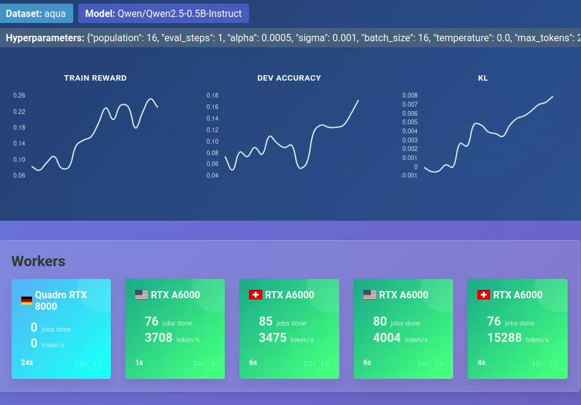

# Open Distributed Evolution Strategies (ODES)

Vibe-coded proof-of-concept for finetuning LLMs with evolution strategy (ES) and distributed GPU workers communicating via http.  

## Web Interface
- [https://odes.schumann.pub](https://odes.schumann.pub/project/1)



## Features
- Distributed evolution strategy with dynamic population scaling
- Lightweight Python client  
- Web interface for real-time monitoring
- Lightweight model state broadcasting

## Requirements
- Python 3.12  
- [vLLM](https://github.com/vllm-project/vllm)  

## Installation
```bash
# Create and activate environment
conda create -n myenv python=3.12 -y
conda activate myenv

# Install dependencies
pip install --upgrade uv
uv pip install vllm --torch-backend=auto

## Usage
```python vllm_client.py --url https://odesapi.schumann.pub --project_id 1```
